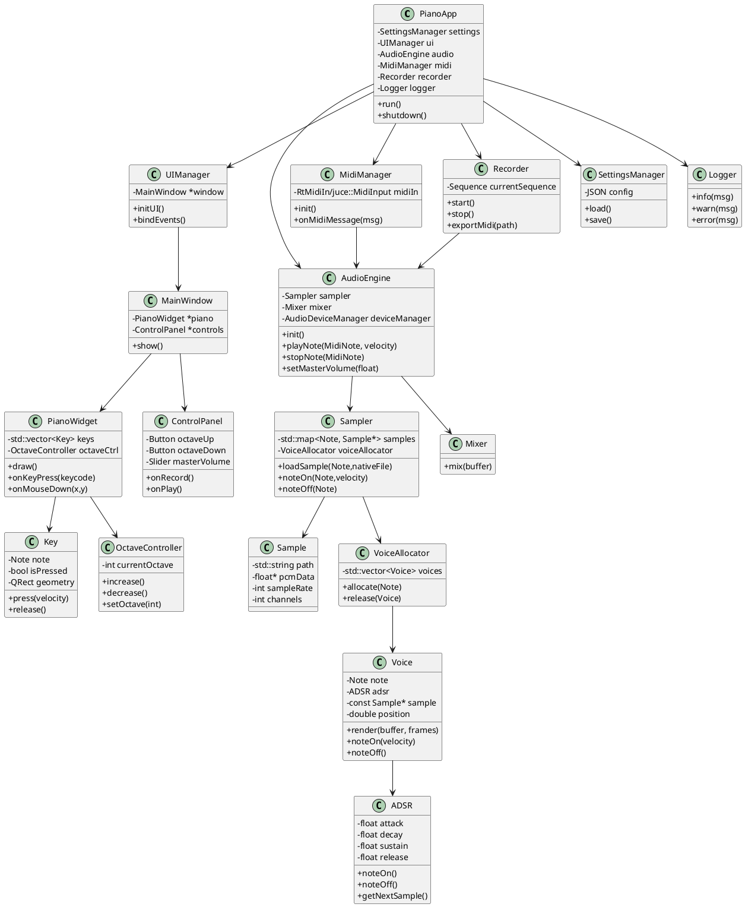

# Команда проекта
* Ганьшин Владислав:
Крутой программист: нашёл библиотеку, применил, собрал проект, внедрил vcpkg, fluidsynth
* Гордиенко Анастасия:
Идейный вдохновитель, подрядчик, помощник: спланировала проект (техническое задание, диаграмма классов, внешний вид, консультирование по музыке и фортепиано) и помогала главному разработчику

# Техническое задание (ТЗ)

## Проект: Pimino – виртуальное пианино для ПК

---

## 1. Общая информация

**Название проекта:** Pimino
**Тип приложения:** Кроссплатформенное десктопное приложение
**Целевая ОС:** Windows, Linux
**Язык разработки:** C++
**Графический фреймворк:** Qt
**Аудио-фреймворк:** FluidSynth

**Назначение приложения:**
Pimino предназначено для имитации игры на фортепиано с использованием компьютерной клавиатуры, мыши или MIDI-клавиатуры, а также для обучения основам игры и записи простых мелодий.

---

## 2. Цели проекта

* Создание интуитивно понятного виртуального пианино.
* Реализация воспроизведения звука в реальном времени.
* Обеспечение низкой задержки (low-latency) звука.
* Поддержка нескольких способов ввода.
* Возможность расширения функционала в будущем.

---

## 3. Функциональные требования

### 3.1 Основные функции

#### 3.1.1 Виртуальная клавиатура пианино

* Отображение 25 клавиш (2 октавы):

  * 15 белых клавиш
  * 10 чёрных клавиш
* Визуальное соответствие реальной раскладке фортепиано.
* Маркировка каждой клавиши подписью:

  * Нота (C, D, E и т.д.)
  * Соответствующая клавиша на QWERTY-клавиатуре

#### 3.1.2 Управление с клавиатуры

* Каждой клавише пианино назначается клавиша компьютера.
* Поддержка одновременного нажатия нескольких клавиш (полифония).
* Реакция в реальном времени без ощутимой задержки.

Пример отображения:

```
A = C
S = D
D = E
...
```

#### 3.1.3 Управление мышью/тачпадом

* Клик по клавише → воспроизведение ноты.
* Нажатие и удержание → звук продолжает звучать.
* Отпускание → звук прекращается с учётом ADSR-огибающей.

#### 3.1.4 Переключение октав

* Всего доступно 7 октав.
* Переключение:

  * Кнопками "+" и "-" в интерфейсе
  * Горячими клавишами клавиатуры
* Отображение текущей октавы на экране.

Диапазон:

* Минимальная: C1
* Максимальная: C7

---

### 3.2 Аудио-функционал

#### 3.2.1 Воспроизведение звука

* Использование WAV-сэмплов фортепиано.
* Поддержка ADSR-огибающей:

  * Attack
  * Decay
  * Sustain
  * Release

#### 3.2.2 Полифония

* Минимум 8 одновременных нот.
* Расширяемо до 32 нот.

#### 3.2.3 Управление громкостью

* Общий уровень громкости (Master Volume).
* Регулировка динамики нажатия (velocity).

---

## 4. Дополнительные (опциональные) функции

### 4.1 Отображение нот на нотном стане

* Визуализация сыгранных нот в режиме реального времени.
* Поддержка скрипичного ключа.
* Прокрутка нотного стана.

### 4.2 Запись мелодии

* Запись последовательности нот.
* Сохранение в формате:

  * MIDI
  * собственный формат Pimino

### 4.3 Изменение звучания

* Выбор тембра:

  * Классическое пианино
  * Электропианино
  * Синтезатор

### 4.4 MIDI-поддержка

* Подключение внешней MIDI-клавиатуры.
* Обработка сообщений NOTE ON / NOTE OFF.

---

## 5. Нефункциональные требования

### 5.1 Производительность

* Задержка не более 10–15 мс.
* Поддержка 60 FPS интерфейса.

### 5.2 Совместимость

* Windows 10+
* Linux (Ubuntu 20.04+)

### 5.3 Интерфейс

#### Основной экран

* Виртуальная клавиатура пианино
* Панель управления:

  * Кнопки + / - (октавы)
  * Индикатор текущей октавы
  * Режим записи
  * Настройки

#### Требования к UI

* Минималистичный дизайн
* Реакция на наведение
* Анимация нажатия клавиш

---

## 6. Техническая архитектура

### 6.1 Слой интерфейса (Qt)

* Отрисовка клавиатуры
* Обработка событий ввода
* Отображение нотного стана

### 6.2 Аудио-слой (FluidSynth)

* Загрузка сэмплов
* Управление ADSR
* Обработка полифонии
* Потоковое воспроизведение

### 6.3 Логика приложения

* Связь UI → Audio Engine
* Управление состояниями
* Обработка событий клавиатуры

---

## 7. Сценарий работы

1. Пользователь запускает приложение.
2. Видит виртуальное пианино.
3. Нажимает клавишу A на клавиатуре.
4. Pimino:

   * Определяет ноту
   * Отправляет команду FluidSynth
   * Начинает воспроизведение
5. Нота визуально подсвечивается.
6. При отпускании клавиши применяется Release-фаза ADSR.

---

## 8. Форматы данных

| Тип    | Формат        |
| ------ | ------------- |
| Аудио  | WAV           |
| Запись | MIDI / PIMINO |
| Конфиг | JSON          |

---

## 9. Структура проекта

```
Pimino/
├── src/
│   ├── ui/
│   ├── audio/
│   ├── core/
├── resources/
│   ├── samples/
│   ├── images/
├── config/
└── docs/
```

---

## 10. Будущие расширения

* Режим обучения
* Подсветка правильных нот
* Поддержка аккордов
* Импорт MIDI файлов

---

## 11. Используемые технологии

| Компонент | Технология      |
| --------- | --------------- |
| UI        | Qt 6            |
| Аудио     | FluidSynth            |
| Язык      | C++17/20        |
| Сборка    | CMake           |
| ОС        | Windows / Linux |

---

## 12. Критерии готовности (Acceptance Criteria)

* Приложение запускается без ошибок
* Появляется клавиатура 25 клавиш
* Звук воспроизводится при нажатии
* Ноты корректно переключаются
* Реализовано переключение октав
* Подсветка работает
* Минимальная задержка

---

# ✅ Итог

Pimino — это легковесное кроссплатформенное приложение для игры на виртуальном пианино, основанное на связке Qt + FluidSynth, с возможностью расширения в полноценный музыкальный инструмент.

---

технические требования к проектам:
* Использование STL: vector, map, string, fstream, алгоритмы.
* Использование классов и ООП: минимум 3 класса (например: User, Post, PostManager).
* Использование файлового ввода/вывода: загрузка/сохранение данных при запуске/выходе.
* Желательно: обработка ошибок (некорректный ввод, отсутствие файла), валидация данных.
* Запрещён «C-стиль»: malloc/free, char*, printf/scanf — использовать std::cout, std::cin, std::string, умные указатели при необходимости.

---

# 14. UML (классовая диаграмма)

Ниже — текстовая UML-диаграмма (PlantUML), которую можно скопировать в любой PlantUML-редактор для просмотра. Диаграмма отражает основные классы системы и их отношения.



> Примечание: диаграмма упрощена для читабельности. В реальной реализации могут появиться дополнительные классы (PluginHost, EffectsChain, UpdateManager, LicensingManager и т.д.).

---
